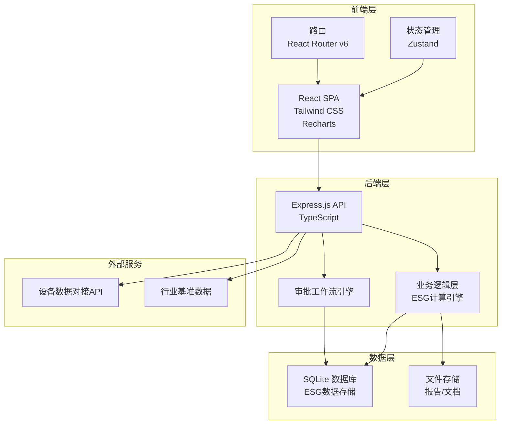
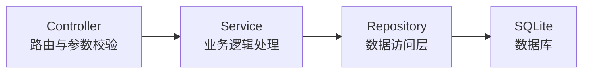
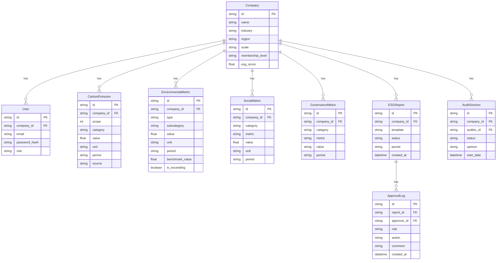

## 1. 架构设计



## 2. 技术说明

- **前端**：React@18 + TypeScript + Tailwind CSS@3 + Vite
- **初始化工具**：vite-init (react-express-ts模板)
- **状态管理**：Zustand
- **图表库**：Recharts
- **后端**：Express@4 + TypeScript (ESM格式)
- **数据库**：SQLite (better-sqlite3)
- **图标库**：lucide-react

## 3. 路由定义

| 路由 | 用途 |
|------|------|
| /login | 登录页面 |
| /register | 注册页面 |
| /dashboard | 仪表盘首页 |
| /carbon | 碳排放管理 |
| /carbon/footprint | 碳足迹报告 |
| /carbon/reduction | 减排方案推荐 |
| /environment | 环境指标 |
| /environment/benchmark | 行业对标 |
| /social | 社会指标 |
| /governance | 治理指标 |
| /report | ESG报告生成器 |
| /report/approval | 审批工作流 |
| /audit | 第三方审计 |
| /membership | 会员体系 |
| /admin | 管理员看板 |
| /prediction | 数据预测 |
| /export | 报表导出 |

## 4. API定义

### 4.1 认证相关

```typescript
interface RegisterRequest {
  companyName: string;
  industry: string;
  scale: string;
  email: string;
  password: string;
}

interface LoginRequest {
  email: string;
  password: string;
}

interface AuthResponse {
  token: string;
  user: {
    id: string;
    companyName: string;
    role: 'enterprise' | 'auditor' | 'admin';
    membershipLevel: 'bronze' | 'silver' | 'gold' | 'diamond';
  };
}
```

### 4.2 碳排放相关

```typescript
interface CarbonEmissionData {
  id: string;
  companyId: string;
  scope: 1 | 2 | 3;
  category: string;
  value: number;
  unit: string;
  period: string;
  source: 'manual' | 'device';
  createdAt: string;
}

interface CarbonFootprintReport {
  id: string;
  companyId: string;
  totalEmissions: number;
  scope1Total: number;
  scope2Total: number;
  scope3Total: number;
  period: string;
  generatedAt: string;
}
```

### 4.3 ESG指标相关

```typescript
interface EnvironmentalData {
  id: string;
  companyId: string;
  type: 'energy' | 'water' | 'waste';
  subcategory: string;
  value: number;
  unit: string;
  period: string;
  benchmarkValue?: number;
  isExceeding: boolean;
}

interface SocialData {
  id: string;
  companyId: string;
  category: 'safety' | 'community' | 'product';
  metric: string;
  value: number;
  unit: string;
  period: string;
}

interface GovernanceData {
  id: string;
  companyId: string;
  category: 'board' | 'compliance' | 'anticorruption';
  metric: string;
  value: number | string;
  period: string;
}
```

### 4.4 报告与审批

```typescript
interface ESGReport {
  id: string;
  companyId: string;
  template: 'GRI' | 'TCFD' | 'custom';
  status: 'draft' | 'pending_esg' | 'pending_cfo' | 'pending_ceo' | 'published' | 'rejected';
  data: Record<string, unknown>;
  createdAt: string;
  publishedAt?: string;
}

interface ApprovalAction {
  reportId: string;
  approverRole: 'esg_lead' | 'cfo' | 'ceo';
  action: 'approve' | 'reject';
  comment?: string;
}
```

### 4.5 审计相关

```typescript
interface AuditSession {
  id: string;
  companyId: string;
  auditorId: string;
  status: 'in_progress' | 'completed';
  startDate: string;
  endDate?: string;
  opinion?: string;
  findings: AuditFinding[];
}

interface AuditFinding {
  module: string;
  status: 'compliant' | 'non_compliant';
  comment: string;
}
```

### 4.6 会员与管理员

```typescript
interface MembershipScore {
  companyId: string;
  dataCompleteness: number;
  performanceScore: number;
  totalScore: number;
  level: 'bronze' | 'silver' | 'gold' | 'diamond';
}

interface AdminDashboardData {
  companyScores: Array<{
    companyId: string;
    companyName: string;
    industry: string;
    region: string;
    esgScore: number;
    reportingRate: number;
    reportStatus: string;
    auditStatus: string;
  }>;
  summary: {
    totalCompanies: number;
    avgScore: number;
    avgReportingRate: number;
    auditPassRate: number;
  };
}
```

## 5. 服务器架构图



## 6. 数据模型

### 6.1 数据模型定义



### 6.2 数据定义语言

```sql
CREATE TABLE company (
  id TEXT PRIMARY KEY,
  name TEXT NOT NULL,
  industry TEXT NOT NULL,
  region TEXT NOT NULL,
  scale TEXT NOT NULL,
  membership_level TEXT DEFAULT 'bronze',
  esg_score REAL DEFAULT 0,
  created_at TEXT DEFAULT (datetime('now'))
);

CREATE TABLE user (
  id TEXT PRIMARY KEY,
  company_id TEXT NOT NULL REFERENCES company(id),
  email TEXT UNIQUE NOT NULL,
  password_hash TEXT NOT NULL,
  role TEXT NOT NULL CHECK(role IN ('enterprise', 'esg_lead', 'cfo', 'ceo', 'auditor', 'admin')),
  created_at TEXT DEFAULT (datetime('now'))
);

CREATE TABLE carbon_emission (
  id TEXT PRIMARY KEY,
  company_id TEXT NOT NULL REFERENCES company(id),
  scope INTEGER NOT NULL CHECK(scope IN (1, 2, 3)),
  category TEXT NOT NULL,
  value REAL NOT NULL,
  unit TEXT NOT NULL,
  period TEXT NOT NULL,
  source TEXT DEFAULT 'manual' CHECK(source IN ('manual', 'device')),
  created_at TEXT DEFAULT (datetime('now'))
);

CREATE TABLE environmental_metric (
  id TEXT PRIMARY KEY,
  company_id TEXT NOT NULL REFERENCES company(id),
  type TEXT NOT NULL CHECK(type IN ('energy', 'water', 'waste')),
  subcategory TEXT NOT NULL,
  value REAL NOT NULL,
  unit TEXT NOT NULL,
  period TEXT NOT NULL,
  benchmark_value REAL,
  is_exceeding BOOLEAN DEFAULT 0,
  created_at TEXT DEFAULT (datetime('now'))
);

CREATE TABLE social_metric (
  id TEXT PRIMARY KEY,
  company_id TEXT NOT NULL REFERENCES company(id),
  category TEXT NOT NULL CHECK(category IN ('safety', 'community', 'product')),
  metric TEXT NOT NULL,
  value REAL NOT NULL,
  unit TEXT NOT NULL,
  period TEXT NOT NULL,
  created_at TEXT DEFAULT (datetime('now'))
);

CREATE TABLE governance_metric (
  id TEXT PRIMARY KEY,
  company_id TEXT NOT NULL REFERENCES company(id),
  category TEXT NOT NULL CHECK(category IN ('board', 'compliance', 'anticorruption')),
  metric TEXT NOT NULL,
  value TEXT NOT NULL,
  period TEXT NOT NULL,
  created_at TEXT DEFAULT (datetime('now'))
);

CREATE TABLE esg_report (
  id TEXT PRIMARY KEY,
  company_id TEXT NOT NULL REFERENCES company(id),
  template TEXT NOT NULL CHECK(template IN ('GRI', 'TCFD', 'custom')),
  status TEXT DEFAULT 'draft' CHECK(status IN ('draft', 'pending_esg', 'pending_cfo', 'pending_ceo', 'published', 'rejected')),
  period TEXT NOT NULL,
  data TEXT,
  created_at TEXT DEFAULT (datetime('now')),
  published_at TEXT
);

CREATE TABLE approval_log (
  id TEXT PRIMARY KEY,
  report_id TEXT NOT NULL REFERENCES esg_report(id),
  approver_id TEXT NOT NULL REFERENCES user(id),
  role TEXT NOT NULL,
  action TEXT NOT NULL CHECK(action IN ('approve', 'reject')),
  comment TEXT,
  created_at TEXT DEFAULT (datetime('now'))
);

CREATE TABLE audit_session (
  id TEXT PRIMARY KEY,
  company_id TEXT NOT NULL REFERENCES company(id),
  auditor_id TEXT NOT NULL REFERENCES user(id),
  status TEXT DEFAULT 'in_progress' CHECK(status IN ('in_progress', 'completed')),
  opinion TEXT,
  findings TEXT,
  start_date TEXT DEFAULT (datetime('now')),
  end_date TEXT
);

CREATE INDEX idx_carbon_company ON carbon_emission(company_id, period);
CREATE INDEX idx_environmental_company ON environmental_metric(company_id, type, period);
CREATE INDEX idx_social_company ON social_metric(company_id, category, period);
CREATE INDEX idx_governance_company ON governance_metric(company_id, category, period);
CREATE INDEX idx_report_company ON esg_report(company_id, status);
CREATE INDEX idx_approval_report ON approval_log(report_id);
CREATE INDEX idx_audit_company ON audit_session(company_id, status);
```
